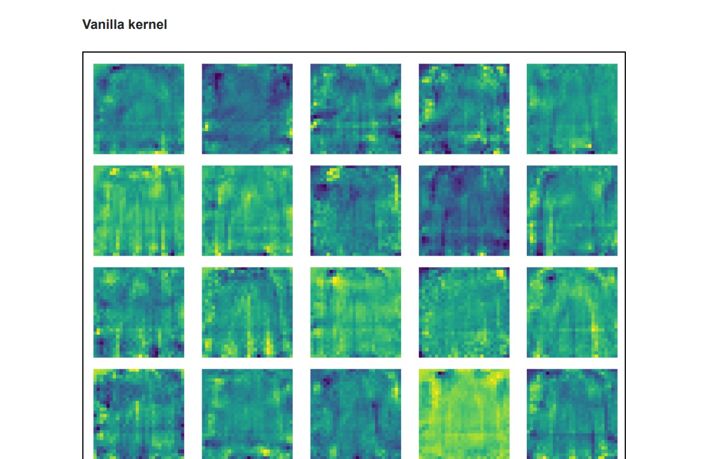

# Auto-Encoders

## Implementation of Auto-Encoders
## Part 1
The code shows how we implemented the Vanilla autoencoder including Encoder, Decoder, and forward passes.
Results from this autoencoder are as follows:

class Autoencoder(nn.Module):

    def __init__(self,dim_latent_representation=2):
    
        super(Autoencoder,self).__init__()
        
        class Encoder(nn.Module):
            def __init__(self, output_size=2):
                super(Encoder, self).__init__()
                self.nn = nn.Sequential(
                nn.Linear(28 * 28, output_size),
            )
            
            def forward(self, x):
                return self.nn(x)
        class Decoder(nn.Module):
            def __init__(self, input_size=2):
                super(Decoder, self).__init__()
                self.nn = nn.Sequential(
                nn.Linear(input_size, 28 * 28),
                nn.Sigmoid(),
                )

## Part 2

Now we compare two factors we changed here compared to the 1st part.
In part 1, we see undercomplete autoencoder since the 2D hidden layer is too smaller than the input (784). Using too few hidden units will result in underfitting. This constraint will also impose the model to lose part of the data information during the compression process.
However, Additional layers can learn complex representations and capture the non-linearity of data better. This can be concluded from the reconstruction loss values as well as the reconstructed samples.

As we can see in the scatter plot, the benefit of ReLUs is sparsity. Sparsity arises when input≤0. The more units with negative values exist in a layer the more sparse the resulting representation. Sigmoids shape a dense representation since they are likely to generate some non-zero value for most of the input values when the range is (0, 1). Hence, if certain neurons are less important in terms of their weights, they will be removed, and the model is sparse.

For better understanding (not required), we also trained the same model, with 1024 hidden units and sigmoid activation function. In the following we included a side-by-side scatter plot of these two models.

Note that we know the advantage of ReLU is avoiding vanishing gradients. However, since
we use a shallow network, this answer would not be acceptable.

## Part 3

Adding noise to the input has a regularizing influence, however, should not overwhelm the input. As we can see, the Vanilla kernel is more like a salt&pepper filter compared to the DAEs. Indeed, the model learns useless information around the less important areas and cancels out that salt&pepper which are small negative and positive values next to the zero.
It also has a few dead (collapsed) kernels. On the other hand, DAE models have smooth filters where important areas receive higher energy. DAEs prevent overfitting and converge faster (plot loss value per epochs ). Although both Gaussian noise and Dropout loss values are similar, they are different in terms of execution time required for the training. In dropout, omitted nodes at each iteration are not updated. Gaussian noise avoids this slowdown by
updating all nodes (kernel weights) at each iteration.

## Part 4
Vanilla

Epoch: 20 Average loss: 0.5638
Val set loss (reconstruction error): 0.5631

VAE
Epoch: 20 Average loss: 0.8426
Val set loss (reconstruction error): 0.7862

Although loss values increased, VAE arranged the latent space such that gaps between latent representations for different classes decreased. It means we can get better manipulated (mixed latents) output. Since VAE follows a normal distribution at the latent space, we can get new unseen images by taking samples from the latent space distribution.
